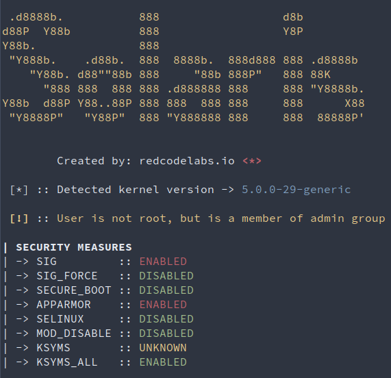

  

  A local LKM rootkit loader

     

## Introduction
This loader can list both user and kernel mode protections that are present on the system, and additionally disable some of them.

It locally drops and compiles source code of any Linux kernel-mode rootkit specified by the user.

## Usage

  

Place the code of your selected rootkit inside `rootkit_template` variable within `solaris.go`. 

Compile the Golang binary and launch it on the target system.

## License

This software is under [MIT License](https://en.wikipedia.org/wiki/MIT_License)